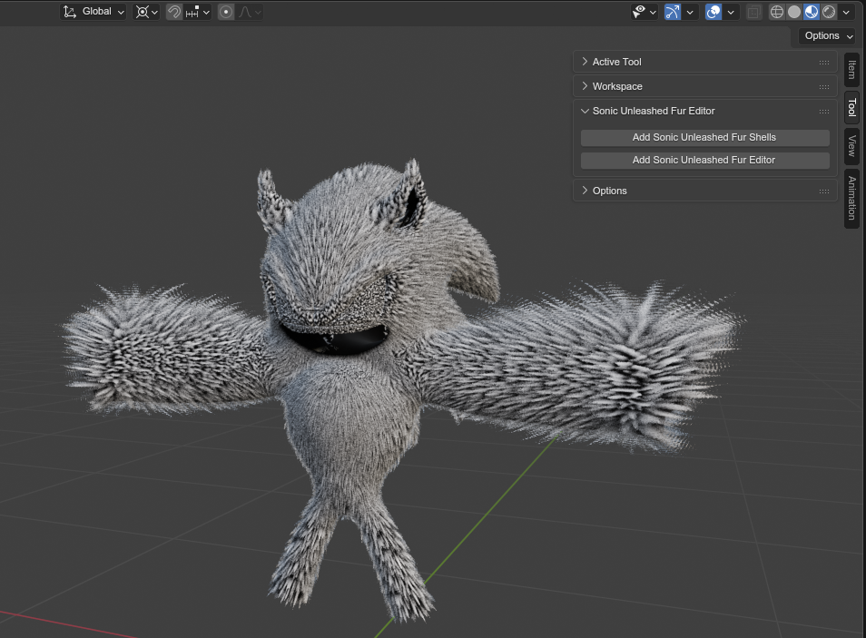
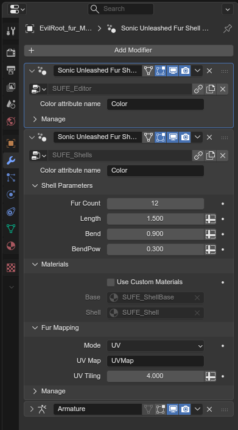
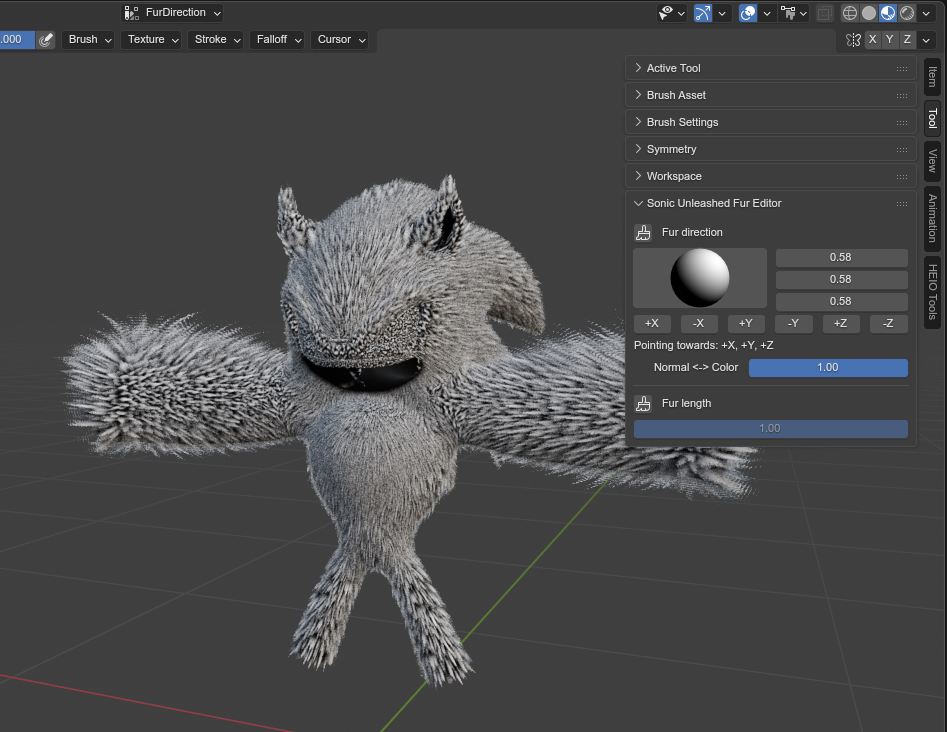

# Sonic Unleashed Fur Painter - Blender 4.2+ addon

This addon adds tools for previewing as well as editing Unleashed fur shells.

Sonic unleashed makes use of normals stored in a meshes vertex colors to generate the fur shells, which can make editing a hassle. This addon adds tools to make the process easier.

## Installation

This addon is installed via a custom extensions repository:
1. Open blender
2. Open the preferences and open the ``Get Extensions`` tab
3. Expand ``Repositories`` on the top right
4. Click the ``+`` on the top right and select ``Add remote Repository``
5. Enter ``https://justin113d.com/blender/release/index.json`` for the URL and check ``Check for Updates on Startup``
6. Confirm
7. Rename the newly added list entry from ``Justin113D.com`` to ``Sonic I/O``
8. Select the list entry, expand the ``advanced`` section and change the module from ``justin113d_com`` to ``sonic_io``
9. Press the 🔄 button in the top right to refresh the module
10. Search for ``Unleashed`` in the search bar and install the ``Sonic Unleashed Fur Editor`` addon

## Usage

### Tools
You will find two tools in the "Tool" tab while in object mode:

- **Add Sonic Unleashed Fur Shells**: Adds a geometry modifier to the active model that generate fur shells
- **Add Sonic Unleashed Fur Editor**: Sets up color attributes for fur direction and length, as well as a geometry modifier to convert those color attributes to correct color data. The shells geometry modifier also gets added.

### Vertex painting
While in vertex paint, the "Tool" tab has different contents:

These menus are used to change your brush color.

You can press the small brush button of each menu to switch to editing the appropriate vertex color attribute.